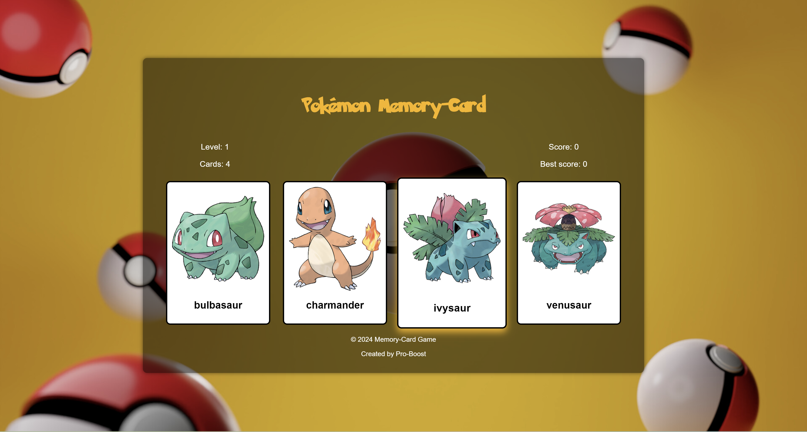

# Pokémon Memory Card Game

Welcome to the Pokémon Memory Card Game! This project is a web-based memory game built using React, where players match Pokémon cards to test their memory skills.

## Table of Contents

- [Introduction](#introduction)
- [Features](#features)
- [Demo](#demo)
- [Technologies Used](#technologies-used)
- [Installation](#installation)
- [Usage](#usage)
- [Fetching Data](#fetching-data)
- [Credits](#credits)
- [License](#license)

## Introduction

This project is a memory card game inspired by Pokémon. Players click on Pokémon cards to reveal them, aiming to match all cards without repeating any. If a card is clicked twice, the score resets. The game includes multiple levels, and failing three times results in a game over.

## Features

- Interactive gameplay with Pokémon cards.
- Multiple difficulty levels.
- Score tracking and game over conditions.
- Responsive design for various screen sizes.

## Demo



## Technologies Used

- React
- CSS (for styling)
- External APIs for Pokémon data

## Installation

To run this project locally, follow these steps:

1. Clone the repository: `git clone https://github.com/pro-boost/Memory_card.git`
2. Navigate to the project directory: `cd Memory_card `
3. Install dependencies: `npm install`

## Usage

Once installed, you can start the development server:

```bash
npm start
```

## Fetching Data

This project fetches Pokémon images from

- `https://img.pokemondb.net/artwork/{pokemonName}.jpg`
- Pokémon data from https://pokeapi.co/api/v2/pokemon.

## Credits

- Pokémon images: [PokemonDB](https://pokemondb.net/)
- Pokémon data: [PokéAPI](https://pokeapi.co/)

## License

This project is licensed under the MIT License - see the LICENSE file for details.
